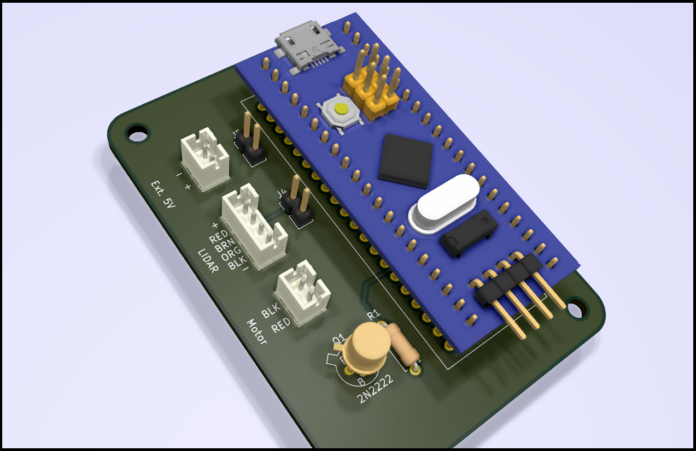

# Neato LIDAR Interface PCB

Format: 

These are the KiCAD design files for an interface PCB for LIDARs units used in Neato XV-11 and Botvac vacuum cleaners.
This board (with the firmware from my other repository xxx) has the following features:
* Conect to the LIDAR using the native cable on the LIDAR unit
* Connects to any computer using USB.  It enumerates are a serial port.
* controls the speed of the mtor using a PID controller.  I find that regulation is better than 0.5%
* Sends raw LIDAR data over the USB cable
* Implements a simple CLI comand interface for test and dignostics and for setting and storing parameters in the interface's FLASH memory
* This interface board uses a generic STM32F103 (Blue Pill) borad for the comput unit.  These cost $2 on eBay.  Doing this means all the tiny SMD parts are already soldered and you just push the board in as if it were a 40-pid DIP IC.
* This PCB exactly fits in a 3D printable stand I designed.  There are two stands one for XV-11 and one for Botvac.

### jumper pins
Instructions for how to jumpper the board are on the back side silk screen.  Youhave the otopn to use either type LIDAR and to power the LIDAR either from USB or an external 5V power supply.  The external supply would only be required of you are connecting to an unpowered hub. (A 500 mA supply is more than large enough.)

### Which type of LIDAR to use?
Both work equally well but there are differences.
#### XV-11
This unit look the best and is the most compact but it uses a slip ring and mechanical brushes to comutate the data and powert othe spinner scanner.   It seems to work but all mechanical brushes will eventualy fail.
#### Botvac
The blastic base has a ugly looking shape.  But the slip ring has been repalced by a non-contact system.  Power is transmitting using a pair of coils that work like a transformer where the secondary is spinning and the data is send up and down the spin axis by a wiresless (and fiberless) optical link.  The only down side is that this LIDAR uses about down the amount of current.   
